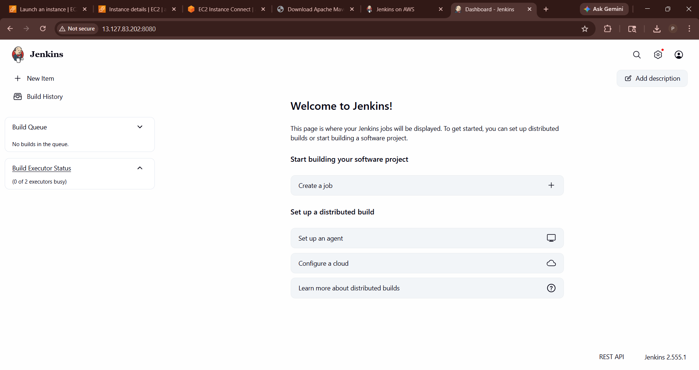
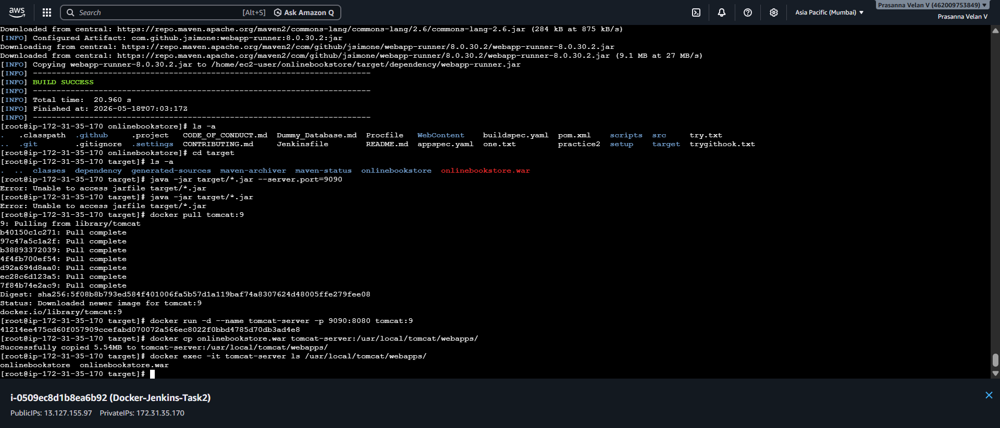

# CI/CD Pipeline for a Java Web Application using Jenkins, Maven and Docker


> An automated build-and-deploy workflow for a Java **Online Bookstore** web application: **GitHub → Jenkins → Maven (WAR) → Docker (Tomcat 9) → live application**, running on an AWS EC2 Linux server.

---

## Table of Contents
1. [Project Overview](#project-overview)
2. [Architecture](#architecture)
3. [Tech Stack](#tech-stack)
4. [Pipeline Workflow](#pipeline-workflow)
5. [Implementation Steps](#implementation-steps)
6. [Result](#result)
7. [Troubleshooting](#troubleshooting)
8. [Limitations and Future Improvements](#limitations-and-future-improvements)
9. [Key Learnings](#key-learnings)
10. [Repository Structure](#repository-structure)
11. [Author](#author)

---

## Project Overview

Manually building, packaging and deploying an application is slow and error-prone. This project automates that delivery process for a Java web application using standard DevOps tools.

- **GitHub** stores the source code and can trigger Jenkins when code is pushed.
- **Jenkins** is the CI/CD server that pulls the code and runs the build.
- **Maven** compiles the project and packages it as a **WAR** file.
- **Docker** runs **Apache Tomcat 9** in a container, which hosts the WAR.
- Everything runs on a **Linux (Amazon Linux 2023) EC2 instance** in AWS Mumbai.

### What this project demonstrates
| Skill | Evidence in this repo |
|---|---|
| CI/CD concepts | Source → build → package → deploy workflow |
| Jenkins | Jenkins server set up and configured on EC2 |
| Build automation | Maven build producing a deployable WAR |
| Containerization | Tomcat 9 running in a Docker container |
| Linux administration | Java, Maven, Jenkins and Docker configured on Amazon Linux |
| Troubleshooting | Resolved port, packaging and deployment issues |

---

## Architecture


A simplified view of the same flow:

```mermaid
flowchart LR
    DEV([Developer]) -->|"git commit & push"| GH["GitHub Repository"]
    GH -->|"Webhook trigger"| J["Jenkins Server"]
    J -->|"mvn clean package"| M["Maven Build"]
    M -->|"Generates WAR"| W["onlinebookstore.war"]
    W -->|"docker cp"| D["Tomcat 9 Docker Container"]
    D --> APP(["Live Online Bookstore"])
```



---

## Tech Stack

| Technology | Purpose |
|---|---|
| Java (Amazon Corretto 21) | Runtime for the build and the application |
| Apache Maven | Build automation and dependency management |
| Git and GitHub | Version control and source repository |
| Jenkins | CI/CD automation server |
| Docker | Containerized runtime for the application |
| Apache Tomcat 9 | Application server hosting the WAR |
| Amazon Linux 2023 on AWS EC2 | Server environment |

---

## Pipeline Workflow

1. **Code change:** the developer commits and pushes code to GitHub.
2. **Trigger:** a GitHub webhook notifies Jenkins about the new commit.
3. **Fetch:** Jenkins pulls the latest source code.
4. **Build:** Maven runs `mvn clean package`. It cleans old output, downloads dependencies, compiles the code and packages the application.
5. **Artifact:** the build produces a deployable **`onlinebookstore.war`** file.
6. **Deploy:** the WAR is placed in a **Tomcat 9 Docker container**, which deploys it automatically.
7. **Access:** the application becomes available in the browser.

---

## Implementation Steps

<details>
<summary><b>Step 1: Prepare the Linux server (AWS EC2)</b></summary>

<br>

- Launch an **Amazon Linux 2023** EC2 instance in the Mumbai region.
- Security group inbound rules: **22** (SSH), **8080** (Jenkins) and **9090** (application).
- Connect over SSH and switch to a working user.

</details>

<details>
<summary><b>Step 2: Install Java and Git</b></summary>

<br>

```bash
sudo yum install java-21-amazon-corretto -y
sudo yum install git -y
java -version
git --version
```


</details>

<details>
<summary><b>Step 3: Install and configure Maven</b></summary>

<br>

```bash
cd /opt
sudo wget https://dlcdn.apache.org/maven/maven-3/<version>/binaries/apache-maven-<version>-bin.tar.gz
sudo tar -xvf apache-maven-<version>-bin.tar.gz
mvn -version
```


</details>

<details>
<summary><b>Step 4: Set up Jenkins</b></summary>

<br>

- Install Jenkins and start the service. It runs on port **8080**.
- Unlock Jenkins with the initial admin password and install the suggested plugins.
- In **Manage Jenkins → Tools**, configure the JDK and Maven installations.
- Create the project job and connect the GitHub repository.
- Add a GitHub webhook so a push triggers the Jenkins job.




</details>

<details>
<summary><b>Step 5: Build the project with Maven</b></summary>

<br>

```bash
git clone <your-project-repository-url>
cd onlinebookstore
mvn clean package
```

Result: `BUILD SUCCESS`, and the WAR file is created in the `target/` folder.


</details>

<details>
<summary><b>Step 6: Run Tomcat 9 in Docker and deploy the WAR</b></summary>

<br>

Jenkins already uses port 8080, so Tomcat's port 8080 is mapped to host port **9090**.

```bash
docker pull tomcat:9
docker run -d --name tomcat-server -p 9090:8080 tomcat:9
docker cp target/onlinebookstore.war tomcat-server:/usr/local/tomcat/webapps/
docker exec -it tomcat-server ls /usr/local/tomcat/webapps/
```

Tomcat automatically unpacks the WAR, and the `onlinebookstore` application folder appears.



</details>

<details>
<summary><b>Step 7: Access the application</b></summary>

<br>

```
http://<EC2-Public-IP>:9090/onlinebookstore/
```


</details>

---

## Result

| Stage | Outcome |
|---|---|
| Jenkins server | ✅ Running on EC2 (port 8080) |
| Maven build | ✅ `BUILD SUCCESS`, WAR generated |
| Docker container | ✅ Tomcat 9 running (host port 9090) |
| Application | ✅ Online Bookstore live in the browser |

---

## Troubleshooting

| Issue | Cause | Fix |
|---|---|---|
| `Unable to access jarfile target/*.jar` | The project packages a **WAR**, not an executable JAR | Deploy the WAR to Tomcat, here through the Docker container |
| Port 8080 already in use | Jenkins uses port 8080 | Map the container to another port, for example `-p 9090:8080` |
| Page not loading in the browser | Port not open in the security group | Allow ports 8080 and 9090 in the EC2 security group |
| `404 Not Found` | WAR not deployed, or wrong URL | Check `/usr/local/tomcat/webapps/` and use the lowercase path `/onlinebookstore/` |

---

## Limitations and Future Improvements

This is a learning-focused implementation. For a production-ready pipeline I would add:

- [ ] **A `Jenkinsfile` (pipeline as code)** with separate Build, Test, Docker and Deploy stages, so the whole flow runs from one pipeline.
- [ ] **A custom `Dockerfile`** that bundles Tomcat and the WAR into a versioned image, instead of copying the WAR into a running container.
- [ ] **Push images to Docker Hub** or Amazon ECR, with tagged versions for rollback.
- [ ] **Automated tests** with JUnit as a pipeline gate.
- [ ] **Code quality analysis** with SonarQube.
- [ ] **Secure Jenkins:** restrict port 8080 by IP, enable HTTPS, and use credentials management.
- [ ] **Notifications** on build success or failure (email or Slack).
- [ ] **Infrastructure as Code** with Terraform or CloudFormation for the EC2 server.
- [ ] **Container orchestration** with Kubernetes, and **monitoring** with Prometheus and Grafana.

---

## Key Learnings

- How a CI/CD pipeline connects source control, a build server and a runtime environment.
- The difference between a **JAR** and a **WAR**, and why a WAR needs an application server like Tomcat.
- Running Jenkins and an application on the same server without port conflicts.
- Using Docker to get a consistent, disposable runtime for a Java web application.
- Reading Maven build logs and fixing build and deployment errors.

---

## Repository Structure

```
.
├── README.md
├── Architecture - CI-CD-Pipeline-Jenkins-Docker.png
├── CI-CD-Pipeline-Jenkins-Docker.pdf
└── Screenshots/
    ├── Jenkins Dashboard.png
    ├── Jenkins.png
    ├── Tomcat-Server.png
    ├── Website Hosted Sucessfully.png
    ├── build sucess.png
    ├── java installation.png
    ├── maven config.png
    └── war file created.png
```

📄 Full project documentation: [`CI-CD-Pipeline-Jenkins-Docker.pdf`](CI-CD-Pipeline-Jenkins-Docker.pdf)

---

## Author

**Prasanna Velan V**: Entry-Level AWS Cloud and DevOps Engineer

📍 Bengaluru, India  |  📧 prasannavelan2003@gmail.com

[LinkedIn](https://www.linkedin.com/in/prasanna-velan-v) · [Portfolio](https://prasannavelanv.netlify.app/) · [Credly Badges](https://www.credly.com/users/prasanna_velan_v) · [GitHub](https://github.com/PrasannaVelanV)

⭐ If you found this project useful, feel free to star the repository.
